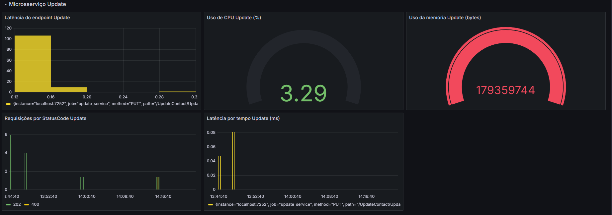

<h1 align="center"> Tech Challenge - Pós Tech </h1>

  

# Índice 

* [Descrição do Projeto](#Descrição-do-projeto)
* [Fase 1](#Fase-1)
* [Fase 2](#Fase-2)
* [Fase 3](#Fase-3)
* [Técnicas e tecnologias utilizadas](#Técnicas-e-tecnologias-utilizadas)

# :pushpin: Descrição do projeto
API em .NET8 feita para entrega dos Tech Chanllenges da Pós Tech FIAP.  
Um aplicativo de gerenciamento de contatos regionais.  
O projeto é divido em 5 fases, cada fase vai representar uma evolução do projeto, implementando novos comportamentos e funcionalidades.
  

# 🥚 Fase 1
Fase inicial onde é criado o projeto e suas camadas, junto cim a persistência de dados.

- `Estrutura`: Uso de DDD (Domain Drive Design) contendo as camadas:  
:bookmark_tabs:API: controllers  
:bookmark_tabs:Application: services e validações  
:bookmark_tabs:Domain: Models de requests e responses  
:bookmark_tabs:Infrastructure: conexão com o banco, implementção do EF  

- `Endpoints`: Foram criados os 4 endpoints para cadastro, consulta, atualização e exclusão de contatos.  
:small_red_triangle_down: `POST` /Contacts/Create: Criação do contato  
:small_red_triangle_down: `GET` /Contacts/GetAllContacts: Consulta de contatos com filtro por DDD  
:small_red_triangle_down: `PUT` /Contacts/Update: Atualização do contato por Id  
:small_red_triangle_down: `DELETE` /Contacts/Delete/{id}: Exclusão do contato por Id  

- `Banco de dados`: Foi usado o banco SQL Server e para a persistência de dados foi usado o Entity Framework, contando com uma estrutura de tabelas relacionando contatos com seus DDDs e a região de cada DDD.  
:file_folder: Tabela Contacts  
:file_folder: Tabela DDDs  
:file_folder: Tabela Regions  

- `Validações`: Usada a lib FluentValidation, validando cada dado da requisição e impedindo a manipulação errada de dados. Foi criado um modelo de validação para cada método http.  
:small_orange_diamond: CreateContactRequestValidator  
:small_orange_diamond: GetContactRequestValidator  
:small_orange_diamond: UpdateContactRequestValidator  

- `Testes unitários`: Testes unitários foram feitos em xUnit para cada camada do projeto.  
:hammer: TechChallenge.Application.UnitTests  
:hammer: TechChallenge.Domain.UnitTests  
:hammer: TechChallenge.Infrastructure.UnitTests 
  

# :hatching_chick: Fase 2
Implementando práticas de Integração contínua (CI), testes de integração e monitoramento de performance.  

- `Pipelines`: Foi integrada a pipeline CI no GitHub Actions, com os jobs:  
:clock1230: build: compilar o projeto e garantir que não há erros.  
:clock1230: unit_tests: executar os testes unitários.  
:clock1230: integration_tests: executar os testes de integração.  

- `Prometheus`: Integrei o prometheus para coletar as métricas do aplicativo, criado o endpoint /metrics.  
:small_red_triangle_down: contacts_request_duration_milliseconds: para calcular a latência das requisições.  
:small_red_triangle_down: cpu_usage_percentage: gauge para medir o uso da CPU.  
:small_red_triangle_down: memory_usage_bytes: gauge para medir o uso da memória.  
:small_red_triangle_down: contacts_http_requests_total: para calcular quantidade de requisíções por status code.  

- `Grafana`: Criação do dashboard com os painéis para monitoramento das métricas coletadas pelo prometheus.  
:red_circle: Painéis para monitoramento de Tempo total acumulado gasto em todas as requisições / número total de requisições feitas ao endpoint. Exibindo quantas requisições foram feitas naquele intervalo de latência. 

:red_circle: Painéis para monitoramento da latência ao longo do tempo, em um rate de 1m. E um painel para exibição da latência média de todas as requisições para todos os endpoints.

:red_circle: Painéis para monitoramento do uso de recursos do sistema como CPU e Memória, mais um painel que exibe a contagem de requisições por status code.

- `Testes de Integração`: Testes para verificar o funcionamento correto da integração com o banco de dados.  
:mag_right: TechChallenge.Application.IntegrationTests
  

# :hatched_chick: Fase 3
Refatorando API em microsserviços com comunicação por eventos via RabbitMQ  
As principais alterações foram:

- `Estrutura`: API virou 5 Microsserviços  
:bookmark_tabs:Microsserviço CreateContactService - Publisher  
:bookmark_tabs:Microsserviço UpdateContactService - Publisher  
:bookmark_tabs:Microsserviço GetContactService - Publisher  
:bookmark_tabs:Microsserviço CreateContactService - Publisher  
:bookmark_tabs:Microsserviço DataPersistenceService - Consumers  

- `RabbitMQ`: A comunicação entre os microsserviços é feita pela mensageria RabbitMQ  
:small_orange_diamond: Fila create_contact_queue  
:small_orange_diamond: Fila update_contact_queue  
:small_orange_diamond: Fila get_contacts_queue  
:small_orange_diamond: Fila delete_contact_queue  

- `Prometheus`: Agora cada microsserviço tem seu endpoint /metrics, ou seja, cada microsserviço possui suas métricas.  
:small_red_triangle_down: Métricas Create:  
**create_contact_request_duration_milliseconds:** Latência do endpoint de create  
**contacts_create_request_total:** Contagem de requisições por statusCode.  
**cpu_usage_percentage_create:** Uso da CPU em tempo real em porcentagem  
**memory_usage_bytes_create:** Uso de memória em tempo real em bytes  

:small_red_triangle_down: Métricas Update:  
**update_contact_request_duration_milliseconds:** Latência do endpoint de update  
**contacts_update_request_total:** Contagem de requisições por statusCode.  
**cpu_usage_percentage_update:** Uso da CPU em tempo real em porcentagem  
**memory_usage_bytes_uppdate:** Uso de memória em tempo real em bytes  

:small_red_triangle_down: Métricas Get:  
**get_contact_request_duration_milliseconds:** Latência do endpoint de get  
**contacts_get_request_total:** Contagem de requisições por statusCode.  
**cpu_usage_percentage_get:** Uso da CPU em tempo real em porcentagem  
**memory_usage_bytes_get:** Uso de memória em tempo real em bytes  

:small_red_triangle_down: Métricas Delete:  
**delete_contact_request_duration_milliseconds:** Latência do endpoint de get  
**contacts_delete_request_total:** Contagem de requisições por statusCode.  
**cpu_usage_percentage_delete:** Uso da CPU em tempo real em porcentagem  
**memory_usage_bytes_delete:** Uso de memória em tempo real em bytes  

- `Grafana`: Reoprganização dos dashboards para exibição por microsserviços. As visualizalizações continuam as mesmas mudando apenas que é por microsserviço agora.  
:red_circle:Create:

:red_circle:Update: 

:red_circle:Get:

:red_circle:Delete:

  

# :chicken: Fase 4
:construction: Em construção :construction:

# :heavy_check_mark: Técnicas e tecnologias utilizadas
`.NET8` `C#` `SQL Server` `GitHub Actions` `Prometheus` `Grafana` `Testes unitários` `Testes de Integração` `xUnit` `EntityFramework`
`FluentValidator` `RabbitMq` `Eventos`
  

# :busts_in_silhouette: Autores
[ Daliane Leme](https://github.com/DalianeLeme)
  
